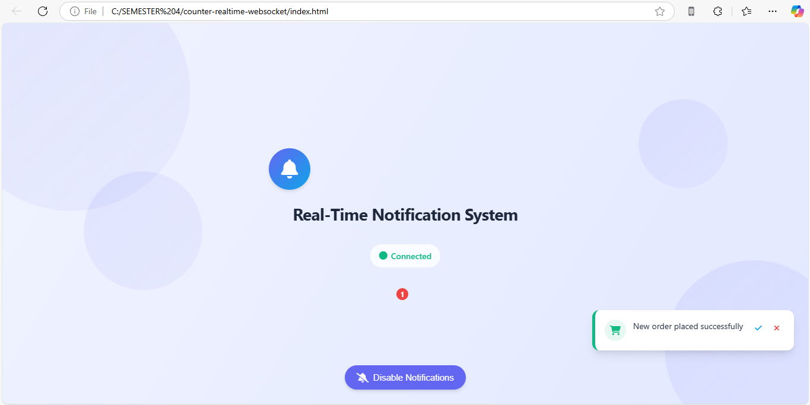

# 🔔 Notifikasi Real-Time dengan WebSocket

## 📋 Deskripsi

Proyek ini adalah implementasi sederhana dari sistem notifikasi real-time berbasis WebSocket. WebSocket memungkinkan komunikasi dua arah antara server dan klien tanpa permintaan berulang (polling), sehingga cocok untuk aplikasi yang membutuhkan update instan seperti notifikasi, dashboard monitoring, atau sistem alert.

Aplikasi ini terdiri dari dua bagian utama:

- Server WebSocket menggunakan Node.js dan library ws

- Klien Web menggunakan HTML, CSS, dan JavaScript untuk menampilkan notifikasi secara langsung

---

## ✨ Fitur Utama

- 🚀 Notifikasi instan tanpa reload halaman

- ⚡ Efisien dan hemat bandwidth (tanpa polling)

- 🖥️ Antarmuka pengguna sederhana dan interaktif

- 🕒 Notifikasi muncul otomatis setiap 5 detik dengan waktu server terkini

---

## 🛠 Teknologi yang Digunakan

- **Node.js** – Backend runtime environment
- **ws** – Library WebSocket untuk Node.js
- **HTML + CSS** – Tampilan antarmuka pengguna (frontend)
- **WebSocket API** – Protokol komunikasi dua arah

---

## 📁 Struktur Proyek

```
real-time-notification/
├── server.js          # Server WebSocket
└── index.html         # Halaman Web Klien
```

---

## 🛠️ Cara Menjalankan

1. Pastikan Node.js telah terpasang.

2. Buat folder proyek dan simpan file server.js dan index.html sesuai struktur di atas.

3. Install dependency WebSocket:

```bash
npm install ws
```

4. Jalankan server WebSocket:

```bash
node server.js
```

5. Buka file `index.html` di browser.

✅ Tip: Untuk melihat notifikasi berjalan, cukup buka halaman HTML tersebut dan biarkan terbuka beberapa detik.

---

## 📸 Tampilan Aplikasi

## 

## 🌐 Referensi

- 🧠 MDN Web Docs - WebSocket API

- 🔗 websocket.org - Examples

- 📦 ws - WebSocket Library for Node.js
